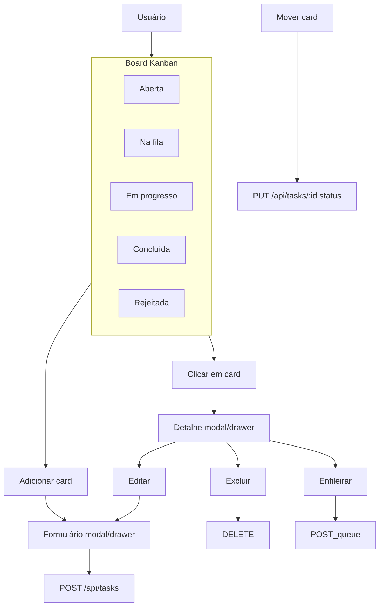

# Jornada do usuário

Experiência principal: **board Kanban** (estilo Trello) com 5 colunas por status, cards arrastáveis e overlays para criar, ver detalhe e editar. Criação/edição por overlay no board (sem rotas `/tasks/new` ou `/tasks/:id/edit`).

---

## 1. Persona e objetivos

- **Quem:** Pessoa que gerencia tarefas processadas pelo agente (worker). Precisa ver o estado do pipeline e agir rápido: criar, mover entre estágios, ver detalhe, enfileirar.
- **Objetivos:** (1) Ver todas as tarefas por estágio (5 colunas); (2) Mover tarefas por drag ou ações no detalhe; (3) Criar, editar e ver detalhe sem sair do board (overlays); (4) Enfileirar tarefas abertas (botão no detalhe ou arrastar para "Na fila").

---

## 2. Cenários de uso

| Cenário | Ação do usuário | Sistema | Resultado |
|--------|------------------|---------|-----------|
| Entrada | Acessa o app | GET /api/tasks | Board com 5 colunas; cards por status. |
| Criar tarefa | "Adicionar card" numa coluna | Overlay formulário | POST /api/tasks; card na coluna. |
| Ver detalhe | Clica em um card | Overlay detalhe | GET /api/tasks/:id; título, status, corpo Markdown; Editar, Excluir, Enfileirar (se open). |
| Mover (drag) | Arrasta card para outra coluna | - | PUT /api/tasks/:id com novo status. |
| Enfileirar | No detalhe, "Enfileirar" | POST /api/tasks/:id/queue | Status → queued; card na coluna "Na fila". |
| Editar / Excluir | No detalhe, Editar ou Excluir + confirmação | Overlay / DELETE | PUT ou DELETE; board atualizado. |
| Agente falha | Worker falha | - | Tarefa → Rejeitada; detalhe mostra failure_reason. |
| Comentários | Usuário ou agente comenta | GET/POST /api/tasks/:id/comments | Comentários no detalhe; agente comenta ao concluir/rejeitar. |
| Progresso do agente | Tarefa in_progress; abre detalhe | GET /api/tasks/:id/log (polling) | Seção "Progresso do agente" em tempo quase real. |
| Deep link | Acessa /tasks/:id | - | Board abre com detalhe da tarefa no overlay. |

---

## 3. Regras de UX

- **Colunas fixas:** Aberta, Na fila, Em progresso, Concluída, Rejeitada. Tarefa rejeitada exibe failure_reason no detalhe.
- **Card:** título; opcionalmente data; corpo só no overlay.
- **Criação:** "Adicionar card" no pé de cada coluna; status inicial = coluna onde clicou.
- **Detalhe e edição:** overlay (drawer/modal). Vista principal = board.
- **Drag-and-drop:** entre colunas; ao soltar → PUT com novo status (optimistic update implementado).
- **Enfileirar:** só para status `open`; botão no detalhe ou arrastar para "Na fila".
- **Feedback:** snackbar em criar, atualizar, excluir, enfileirar e ao mover (erro de API).
- **Responsividade:** board com scroll horizontal; colunas com largura mínima; em mobile, scroll horizontal. Ver [04-ux-acessibilidade.md](04-ux-acessibilidade.md).

---

## 4. Fluxo (Mermaid)

---

## 5. Jornada legado (vista lista)

O fluxo original era lista + rotas. Hoje a entrada é sempre o board; criação/edição por overlay. O pipeline tem **5 status:** `open`, `queued`, `in_progress`, `done`, `rejected`. Lista na tela: título, status (Aberta / Na fila / Em progresso / Concluída / Rejeitada), opcionalmente data. Formulário: título obrigatório, status, corpo Markdown. Detalhe: Markdown renderizado. Exclusão com confirmação; feedback por toasts/snackbars.
